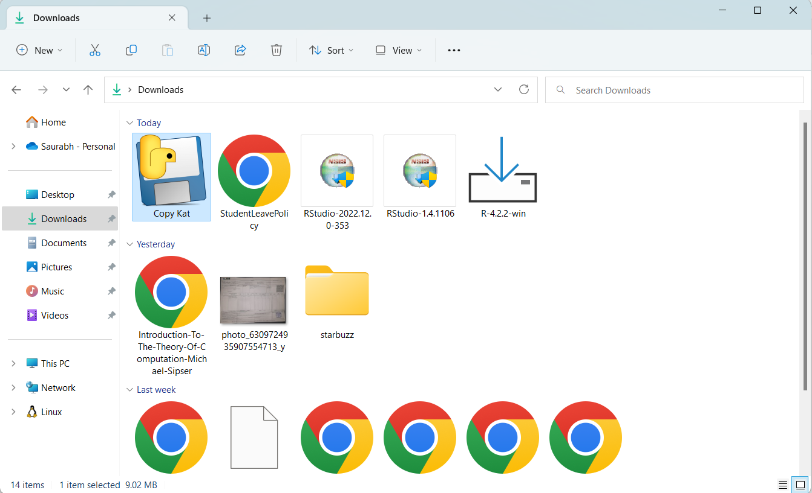
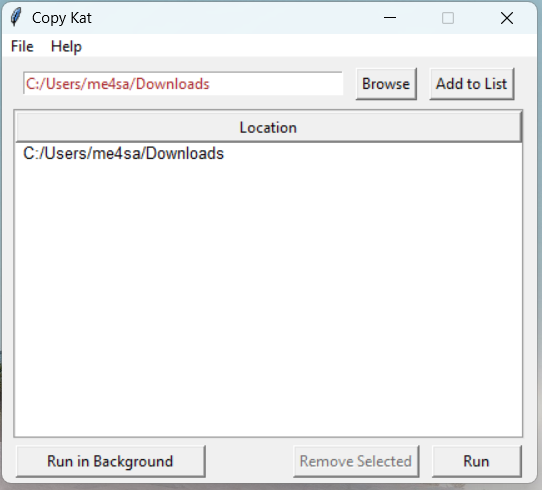
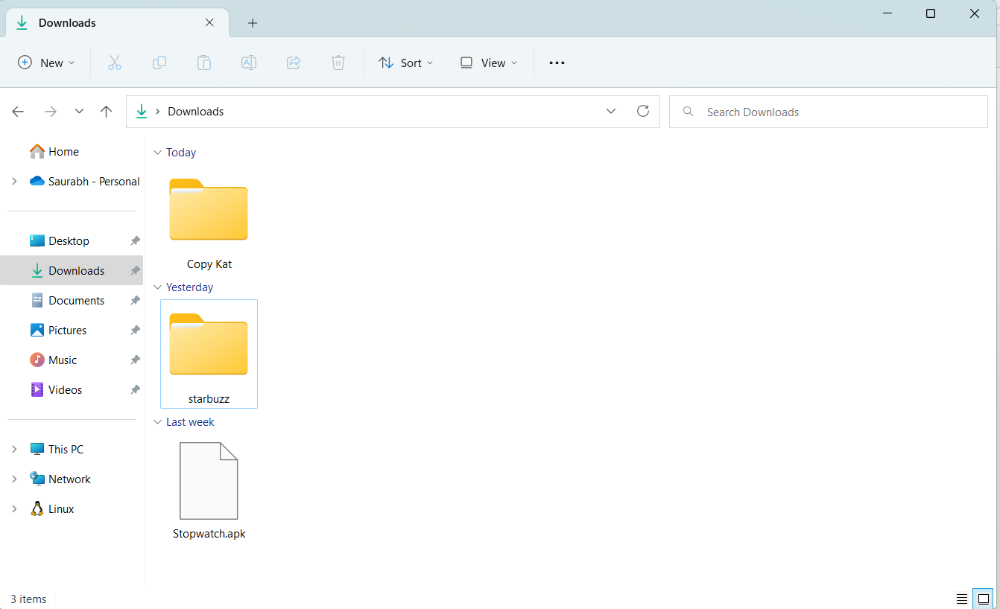
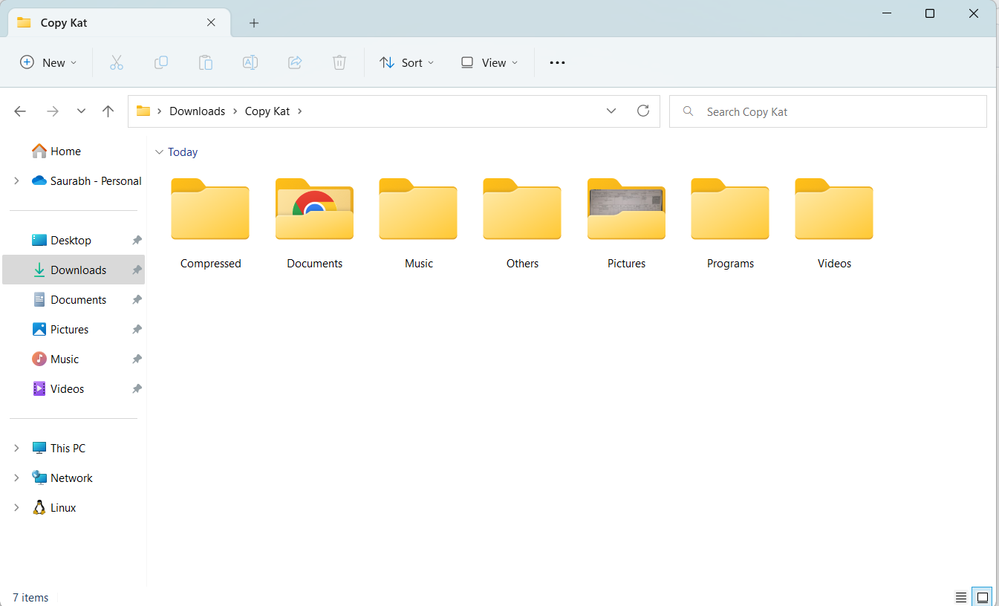
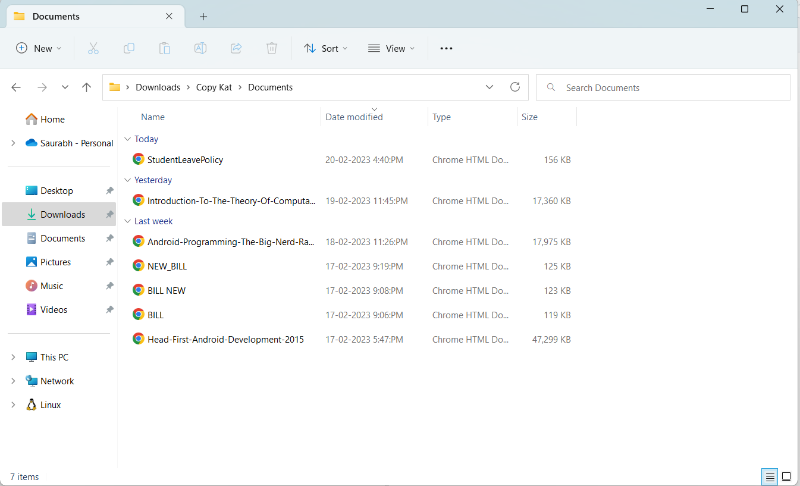

# Copy Kat
Organize your folders in one click. You can download and use the .exe file available in this repo.

## **Demonstrations**
### _**Downloads** folder before running copyKat_

### **_Running copyKat to organize downloads folder_**
_Select folder to organize and click on **Run**:_

 ### **_Downloads folder after running CopyKat_**
 A folder named _Copy Kat_ is created and all the files are moves inside it.
 

 Inside copyKat, various folders are created and files are moved to these folder based on their file types.
 

 Inside **_CopyKat > Documents_**
 